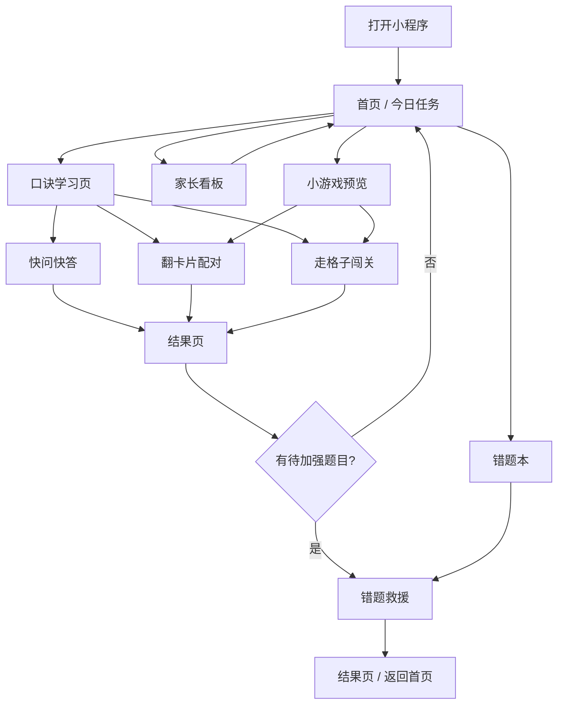

# 前端页面状态流转图 + TypeScript 类型对照

这个版本对应 `miniprogram/types/api.ts` 和 `miniprogram/utils/request.ts`。

## 页面主流程

## 页面状态

### 首页 `pages/home/index`

- `loading`
- `ready`
- `navigating`

对应字段：

- `currentDay`
- `dayTitle`
- `stars`
- `todayTasks`
- `todayProgress`

### 学习页 `pages/learn/index`

- `loading`
- `showingRhymes`
- `showingTips`
- `readyToPractice`

对应字段：

- `targetTables`
- `rhymes`
- `visualExample`
- `tips`

### 快问快答 `pages/quiz/index`

- `loadingSession`
- `answering`
- `showingFeedback`
- `finishing`

对应字段：

- `sessionId`
- `questions`
- `currentIndex`
- `currentQuestion`
- `correctCount`
- `comboCount`

### 翻卡片配对 `pages/match/index`

- `loadingRound`
- `waitingFirstFlip`
- `waitingSecondFlip`
- `checkingPair`
- `roundComplete`

对应字段：

- `cards`
- `openedCardIds`
- `matchedCount`
- `totalPairs`

### 走格子闯关 `pages/level/index`

- `loadingLevel`
- `answering`
- `stepForward`
- `levelComplete`

对应字段：

- `trackLength`
- `currentStep`
- `questions`
- `currentQuestion`

### 错题救援 `pages/rescue/index`

- `loadingWrongItems`
- `rescuing`
- `showingExplain`
- `complete`

对应字段：

- `wrongItems`
- `rescuedCount`
- `showExplain`

### 结果页 `pages/result/index`

- `loadingResult`
- `showingSummary`
- `readyForNextAction`

对应字段：

- `correctCount`
- `accuracy`
- `weakItems`
- `reward`
- `nextAction`

## 类型文件入口

- 统一接口和实体类型：`/Users/sdragon/PlusAPP/miniprogram/types/api.ts`
- mock 接口实现：`/Users/sdragon/PlusAPP/miniprogram/utils/request.ts`
- 本地存储封装：`/Users/sdragon/PlusAPP/miniprogram/utils/storage.ts`

## 推荐前端拆分顺序

1. 首页 + 学习页
2. 快问快答 + 结果页
3. 错题本 + 错题救援
4. 翻卡片配对 + 走格子闯关
5. 家长看板 + 奖励动效
